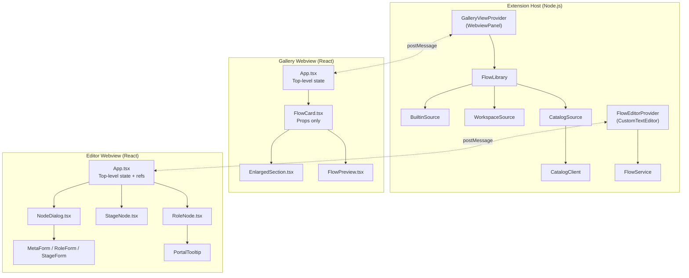

# Message Flowing & State Propagation

This document describes how events, state, and data flow between the extension host (Node.js) and the two webview UIs (React in the browser sandbox). It covers both the **Gallery** (flow browser/installer) and the **Editor** (visual flow canvas).

## Architecture Overview



## Primitives

### Host → Webview: `postMessage()`

The extension host sends structured messages to the webview. The webview receives them via `window.addEventListener('message', handler)`.

```typescript
// Host side
webviewPanel.webview.postMessage({ type: 'someType', payload: … });

// Webview side
window.addEventListener('message', (e: MessageEvent) => {
    const msg = e.data as { type: string; [k: string]: unknown };
    switch (msg.type) { … }
});
```

### Webview → Host: `acquireVsCodeApi().postMessage()`

The webview calls `acquireVsCodeApi()` injected by VS Code, which returns an object with `postMessage()`. The host receives it via `webviewPanel.webview.onDidReceiveMessage()`.

```typescript
// Webview side
declare function acquireVsCodeApi(): { postMessage(msg: unknown): void };
const vscode = acquireVsCodeApi();
vscode.postMessage({ type: 'someType', … });

// Host side
webviewPanel.webview.onDidReceiveMessage(msg => {
    switch (msg.type) { … }
});
```

---

## 1. Gallery Flow

### 1.1 Initialization

```
GalleryViewProvider                    gallery/App.tsx
       │                                      │
       │ ──── buildHtml() ────────────────►  │ (iframe loads)
       │                                      │
       │                                      │ useEffect fires:
       │  ◄──────── { type: 'ready' } ─────── │
       │                                      │
       │ _sendFlows()                         │
       │  ├─ library.getAll()                 │
       │  │  ├─ BuiltinSource.getAll()        │
       │  │  ├─ CatalogSource.getAll()        │
       │  │  └─ WorkspaceSource.getAll()      │
       │  └─ enrich with metadata/YAML        │
       │                                      │
       │ ──── { type: 'update',              │
       │         flows: <enriched[]> } ─────► │ setFlows(flows)
       │                                      │ re-render list
```

**Summary**: `ready` triggers `_sendFlows()` which gathers entries from all three sources, eagerly fetches YAML content for previews, computes role counts/orchestration, and posts the enriched array back to the webview.

### 1.2 Preview Loading

```
FlowCard.tsx                           GalleryViewProvider
       │                                      │
       │ onTogglePreview()                    │
       │  ◄─ callback prop from App           │
       │                                      │
       │ App: setPreviewId(id)                │
       │ App: vscode.postMessage(             │
       │       { type: 'getPreview', id }) ──►│
       │                                      │ _sendPreview(id)
       │                                      │  ├─ library.find(id)
       │                                      │  ├─ read YAML from source
       │                                      │  └─ postMessage back
       │                                      │
       │  ◄── { type: 'preview',             │
       │         id, content } ────────────── │
       │                                      │
       │ App: setPreviewYaml(content)         │
       │ re-render FlowCard with              │
       │ previewYaml prop                     │
```

**Summary**: Clicking the magnifier toggles `previewId` in App state. If expanding, App requests the YAML content from the host. The host reads the file (or fetches from catalog) and posts it back. The enlarged preview can also be triggered from an "Enlarged preview" overlay button that sets local state and calls an `onTogglePreview` callback.

### 1.3 Install Flow

```
FlowCard.tsx                           GalleryViewProvider
       │                                      │
       │ onInstall() →                        │
       │  App: setInstallStates({ [id]:       │
       │        'pending' })                  │
       │  App: vscode.postMessage(            │
       │        { type: 'install', id }) ────►│
       │                                      │ _handleInstall(id)
       │                                      │  ├─ library.find(id)
       │                                      │  ├─ library.install(entry,
       │                                      │  │    '.github/flows/')
       │                                      │  └─ postMessage back
       │                                      │
       │  ◄── { type: 'installDone',         │
       │         id, success, message } ───── │
       │                                      │
       │ App: setInstallStates({              │
       │   [id]: success?'done':'error' })    │
       │ App: setInstallMessages({            │
       │   [id]: message })                   │
```

**Summary**: Install is a three-phase async operation: App marks the card `pending` → host writes the file → App marks `done` or `error` with a message. `FlowCard` reads `installState` and renders the appropriate button state.

### 1.4 Open Editor from Gallery

```
FlowCard.tsx                           GalleryViewProvider
       │                                      │
       │ handleOpenEditor()                   │
       │  (via (window as any).vscode)        │
       │                                      │
       │ ──── { type: 'openEditor',          │
       │         id } ───────────────────────►│
       │                                      │ _handleOpenEditor(id)
       │                                      │  ├─ For catalog flows:
       │                                      │  │  ├─ fetch content
       │                                      │  │  ├─ create in .github/flows/
       │                                      │  │  ├─ openWith('flowEditor')
       │                                      │  │  └─ _sendFlows() refresh
       │                                      │  └─ For builtin/workspace:
       │                                      │     └─ openWith('flowEditor')
```

**Note**: `FlowCard` bypasses the parent App for some actions by accessing `(window as any).vscode` set by App's module-level assignment. This avoids deeply nested callback drilling.

### 1.5 State Within Gallery React Components

```
App.tsx (top-level state owner)
  │
  │  useState: flows[], query, previewId, previewYaml,
  │            installStates{}, installMessages{},
  │            difficultyFilters Set
  │
  ├── Search bar:   onChange → setQuery()
  ├── Filter chips: onClick → setDifficultyFilters()
  │
  └── FlowCard (props only)
        │  Props: flow, installState, installMessage,
        │         expanded, previewYaml,
        │         onInstall, onTogglePreview,
        │         onQuickRun, onOpenTutorial
        │
        │  Local: showMoreMenu (dropdown toggle)
        │
        └── EnlargedSection (props only)
              │  Props: flowId, yaml, onOpenEditor,
              │         onViewYaml, onCollapse
              │  Local: showAllRoles (role list toggle)
              │
              └── FlowPreview (shared component, pure render)
                    Props: yaml, height, compact
```

**Pattern**: Unidirectional top-down prop flow. Children communicate upward via callback props. All shared state lives in `App.tsx`.

---

## 2. Editor Flow

### 2.1 Initialization and Document Sync

```
FlowEditorProvider                    editor/App.tsx
       │                                      │
       │ resolveCustomTextEditor()            │
       │  ├─ buildHtml()                      │
       │  ├─ listen onDidReceiveMessage       │
       │  └─ listen onDidChangeTextDocument   │
       │                                      │ (iframe loads)
       │                                      │
       │                                      │ useEffect fires:
       │  ◄──────── { type: 'ready' } ─────── │
       │                                      │
       │ sendUpdate()                         │
       │ ─── { type: 'update',               │
       │       content: document.getText()} ─►│ parseFlowDoc(content)
       │                                      │ → setNodes / setEdges
       │                                      │
       │ ───── External text editor ──────    │
       │ onDidChangeTextDocument              │
       │  (skipped if caused by webview)      │
       │ ─── { type: 'update', content } ────►│ re-parse & update canvas
```

**Echo prevention**: The host tracks `lastWebviewContent` — the last YAML string it received from the webview. When `onDidChangeTextDocument` fires and the new document text equals `lastWebviewContent`, the host skips the update (it was caused by the webview's own write).

### 2.2 User Edit → Serialize → Write Back

```
editor/App.tsx                         FlowEditorProvider
       │                                      │
       │ User drags node                      │
       │  onNodesChange fires                 │
       │  ├─ position.type === 'position'     │
       │  │  && !dragging                     │
       │  │  → isDirtyRef = true              │
       │  │  → positionsRef.set(id, pos)      │
       │  └─ setNodes(applyNodeChanges)       │
       │                                      │
       │ useEffect: isDirty && nodes changed  │
       │  → scheduleSerialize()  [600ms deb]  │
       │     └─ serializeFlowDoc(nodes)       │
       │        → yamlToText(fm)              │
       │                                      │
       │ ─── { type: 'change',               │
       │       content: yamlString } ────────►│
       │                                      │ onDidReceiveMessage
       │                                      │  ├─ Guard: skip if content
       │                                      │  │  === document.getText()
       │                                      │  ├─ lastWebviewContent=content
       │                                      │  └─ WorkspaceEdit.replace(
       │                                      │       document, content)
       │                                      │
       │                                      │ onDidChangeTextDocument
       │                                      │  ├─ Document text equals
       │                                      │  │  lastWebviewContent
       │                                      │  └─ SKIP (echo prevention)
```

**Key**: Two guard mechanisms prevent infinite loops:
1. `isDirtyRef` ensures only genuine user edits (not React Flow internal measurements) trigger serialization.
2. `lastReceivedContentRef` in the webview and `lastWebviewContent` in the host prevent re-serializing content that hasn't actually changed.

### 2.3 Run Flow from Editor

```
editor/App.tsx                         FlowEditorProvider
       │                                      │
       │ ▶ Run button clicked                 │
       │  vscode.postMessage(                 │
       │    { type: 'run' }) ────────────────►│
       │                                      │ onDidReceiveMessage
       │                                      │  └─ executeCommand(
       │                                      │       'feima.copilot-ai-flow
       │                                      │        .runFlow',
       │                                      │        document.uri)
       │                                      │
       │                                      │ commands/index.ts: runFlow
       │                                      │  ├─ showInputBox("prompt?")
       │                                      │  └─ workbench.action.chat.open({
       │                                      │       query: "@flow #file:…
       │                                      │               <prompt>" })
```

### 2.4 Node Edit Dialog (Save/Discard Pattern)

```
NodeDialog.tsx (draft state, not real node)
       │
       │ Opens:
       │  1. Snapshot node.data into `draft` state
       │     const { onChange, onEdit, onDelete, ...rest } = node.data
       │     setDraft({ ...rest })
       │
       │  2. Create proxy object (draftData) with live callbacks
       │     { ...draft, onChange: (patch) => updateDraft(patch) }
       │     └─ Form components write to draft via Proxy
       │
       │ User edits fields → updateDraft() → setDraft()
       │
       │ Save button:
       │  1. node.data.onChange(draft)  ← flush entire draft to real node
       │  2. onClose()
       │
       │ Discard / ✕ / Escape:
       │  1. onClose()  ← draft thrown away, nothing persisted
       │  2. Draft state is GC'd
```

**Key**: The dialog edits a **local copy**. The real node is only mutated on Save. This prevents live mutations during typing (which would trigger debounced serialization for every keystroke) and allows cancellation.

### 2.5 State Within Editor React Components

```
App.tsx (top-level state owner)
  │
  │  useState: nodes[], edges[], editingNodeId,
  │            showMiniMap, showMetaTooltip
  │
  │  useRef (mutable, doesn't trigger re-render):
  │    nodesRef, rawBodyRef, stageMetaRef,
  │    positionsRef, isDirtyRef,
  │    lastReceivedContentRef, serializeTimerRef
  │
  │  Message handler (useEffect):
  │    'update' → parseFlowDoc → buildNodes → setNodes/setEdges
  │
  │  Dirty-serialize (useEffect):
  │    guards: isDirtyRef && nodes.length > 0
  │    action: scheduleSerialize()
  │
  │  onNodesChange / onEdgesChange:
  │    React Flow callbacks → setNodes/setEdges
  │    Drag-end also marks positionsRef + isDirtyRef
  │
  ├── withCallbacks() injects into node.data:
  │     node.data.onChange(patch)  → setNodes + isDirtyRef=true
  │     node.data.onDelete()       → setNodes + setEdges + isDirtyRef=true
  │     node.data.onEdit()         → setEditingNodeId(node.id)
  │
  ├── RoleNode (node props)
  │     Local: showTooltip (magnifier button hover)
  │     Portal: PortalTooltip → document.body
  │
  ├── StageNode (node props)
  │     No local state
  │
  ├── NodeDialog (floating overlay)
  │     Local: draft (snapshot of node data)
  │     Save   → node.data.onChange(draft) → flushes
  │     Discard → onClose()
  │
  └── Meta panel overlay (React Flow Panel)
        Local: showMetaTooltip (magnifier hover)
        Portal: PortalTooltip → document.body
```

---

## 3. Portal-Based Tooltips

Both the role node magnifier and the meta panel magnifier use `PortalTooltip` to escape React Flow's CSS transform stacking context.

```
RoleNode.tsx / App.tsx               PortalTooltip.tsx
       │                                      │
       │ Magnifier button hover               │
       │  → setShowTooltip(true)              │
       │                                      │
       │ <PortalTooltip                       │
       │   text={d.prompt}                    │
       │   triggerRef={buttonRef}             │
       │   visible={showTooltip}              │
       │   direction="up" />                  │
       │                                      │
       │                      useLayoutEffect │
       │                      ├─ getBoundingClientRect()
       │                      │  of triggerRef
       │                      └─ setPos({ top, left })
       │                                      │
       │                      createPortal(   │
       │                        <div          │
       │                          className=  │
       │                           "portal-   │
       │                           tooltip"   │
       │                          style={{    │
       │                            position: │
       │                              fixed,  │
       │                            top, left │
       │                          }}>         │
       │                          markdownToHtml│
       │                        </div>,       │
       │                        document.body │
       │                      )               │
```

**Why portal?** React Flow nodes are inside `.react-flow__viewport` which applies `transform: translate(x, y)` — this creates a CSS stacking context that traps `z-index`. Portal tooltips are rendered into `document.body` with `position: fixed`, completely escaping that context.

---

## 4. Source Data Layer

```
FlowLibrary
  │
  ├── BuiltinSource extends FlowSourceBase
  │     load() → scan examples/*.flow.yaml
  │     │         parseMetadata (js-yaml)
  │     └─→ IFlowEntry[]  (source: 'builtin')
  │
  ├── WorkspaceSource extends FlowSourceBase
  │     load() → scan .github/flows/*.flow.yaml
  │     │         parseMetadata (js-yaml)
  │     watch() → fs watcher → invalidate cache
  │     └─→ IFlowEntry[]  (source: 'workspace')
  │
  └── CatalogSource extends FlowSourceBase
        load() → CatalogClient.getIndex()
        │        → catalogFlowToEntry() conversion
        └─→ IFlowEntry[]  (source: 'catalog')
```

All three sources cache their entries and share the same `FlowSourceBase.findById`, `search()`, and `refresh()` logic.

---

## 5. Message Type Reference

### Gallery Messages

| Direction | Type | Payload | Purpose |
|-----------|------|---------|---------|
| Web→Host | `ready` | — | Webview mounted, send flows |
| Host→Web | `update` | `flows: IFlowEntryMessage[]` | Replace flow list |
| Web→Host | `getPreview` | `id: string` | Request YAML for preview |
| Host→Web | `preview` | `id, content: string` | YAML content for FlowPreview |
| Web→Host | `install` | `id: string` | Install flow to workspace |
| Host→Web | `installDone` | `id, success: bool, message` | Install result |
| Web→Host | `openEditor` | `id: string` | Open flow in visual editor |
| Web→Host | `uninstall` | `id: string` | Delete from workspace |
| Web→Host | `viewYaml` | `id: string` | Open as raw text |
| Web→Host | `openUrl` | `url: string` | Open external URL |
| Web→Host | `createFromTemplate` | — | Trigger template flow creation |

### Editor Messages

| Direction | Type | Payload | Purpose |
|-----------|------|---------|---------|
| Web→Host | `ready` | — | Webview mounted, send document |
| Host→Web | `update` | `content: string` | Full YAML document text |
| Web→Host | `change` | `content: string` | Serialized YAML from canvas edits |
| Web→Host | `run` | — | Execute flow in chat |
| Web→Host | `openTextEditor` | — | Switch to text editor pane |

---

## 6. Guard Patterns

### Echo Prevention (Editor)

The shared `TextDocument` model means both the text editor and the visual editor can modify the document. To prevent infinite loops:

- **Host side**: Tracks `lastWebviewContent` — skips `sendUpdate()` when the document change was caused by the webview's own `WorkspaceEdit`.
- **Webview side**: Tracks `lastReceivedContentRef` — skips `postMessage('change')` when the serialized content is identical to the last received content (e.g., node position drag with no YAML impact).

### Dirty Flag (Editor)

`isDirtyRef` gates the serialization effect. It is:
- Set to `true` when the user takes a meaningful action (dialog Save, delete role, drag-end)
- Set to `false` when receiving an `update` from the host, and after `scheduleSerialize` fires
- Left as `false` for React Flow internal changes (dimension measurements, mid-drag position updates)
